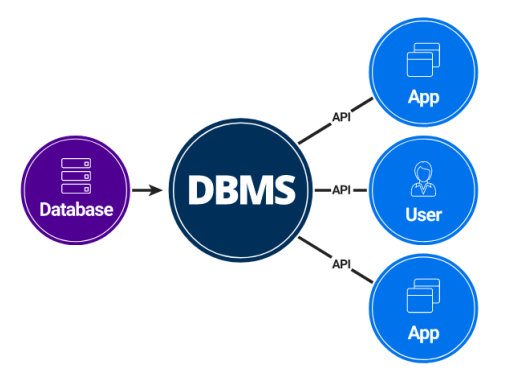
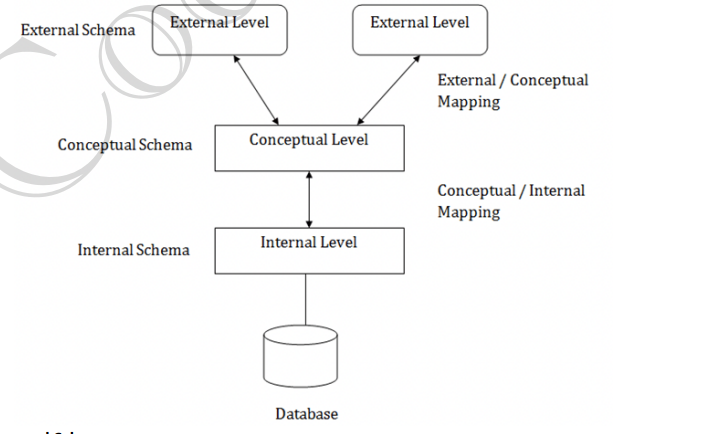
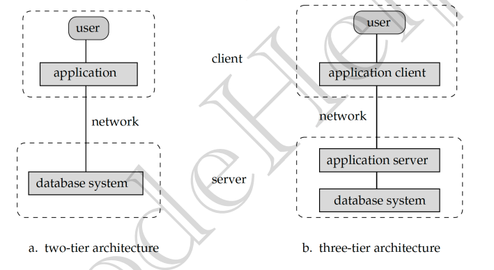
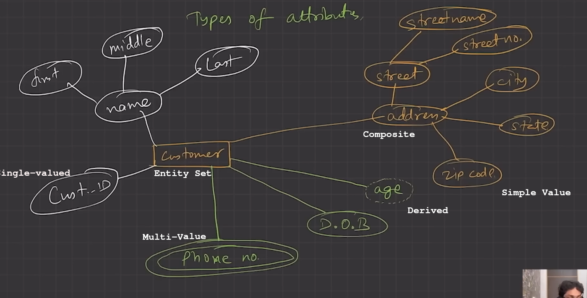
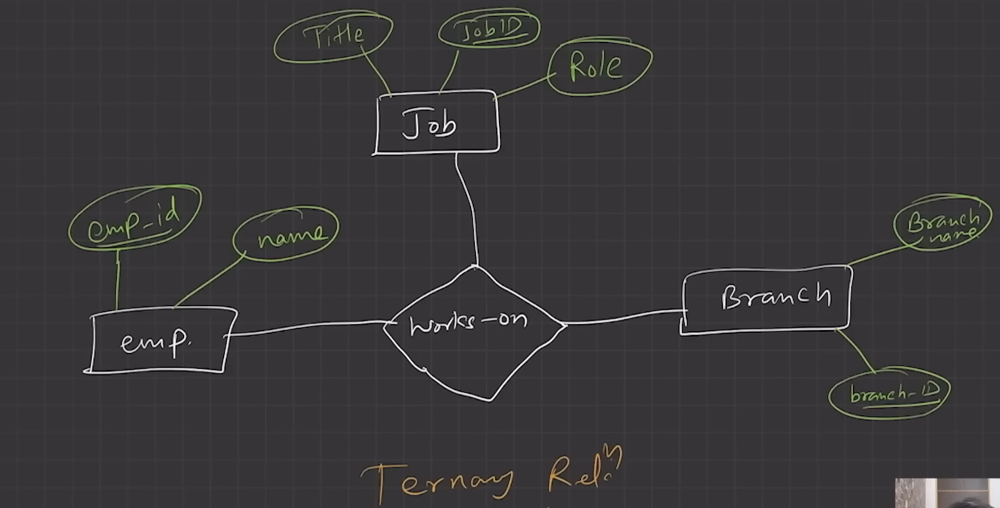
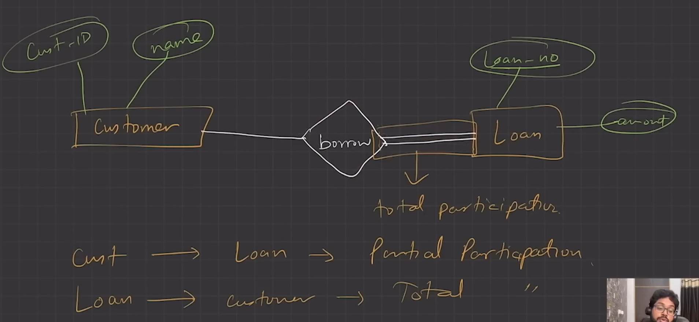
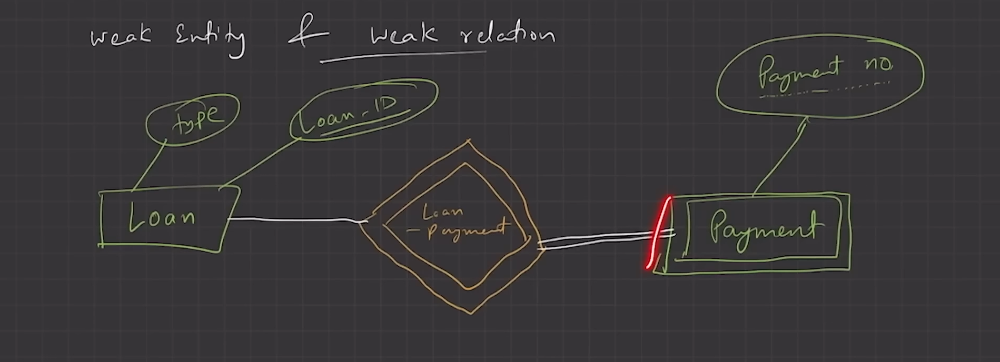
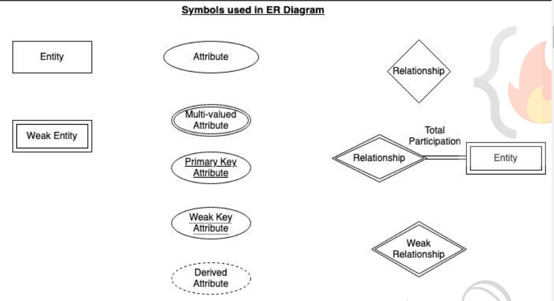

# DBMS

## Lecture 1 : Introduction to DBMS

### What is Data ?

> Data is a collection of raw bits/bytes
eg: text, observations, figures, symbols, and descriptions of things.

> Data does not carry any specific purpose and has no significance by itself

Moreover, data is measured in terms of bits and bytes – which are basic units of information in the context of computer storage and processing.

> Data can be recorded and doesn’t have any meaning unless processed

### Type of Data

a. Quantitative
  i. Numerical form
  ii. Weight, volume, cost of an item

b. Qualitative
  i. Descriptive, but not numerical.
  ii. Name, gender, hair color of a person

### What is Information?

a. Info. Is processed, organized, and structured data.

b. It provides context of the data and enables decision making.

c. Processed data that make sense to us.

d. Information is extracted from the data, by analyzing and interpreting pieces of data.

e. E.g.,you have data of all the people living in your locality, its Data, when you analyze and interpret
the data and come to some conclusion that:
  i. There are 100 senior citizens.
  ii. The sex ratio is 1.1.
  iii. Newborn babies are 100.
These are information

### Data vs Information

a. Data is a collection of facts, while information puts those facts into context.

b. While data is raw and unorganized, information is organized.

c. Data points are individual and sometimes unrelated. Information maps out that data to provide a big-picture view of how it all fits together.

d. Data, on its own, is meaningless. When it’s analyzed and interpreted, it becomes meaningful
information.

e. Data does not depend on information; however, information depends on data.

f. Data typically comes in the form of graphs, numbers, figures, or statistics. Information is typically presented through words, language, thoughts, and ideas.

g. Data isn’t sufficient for decision-making, but you can make decisions based on information.

### What is Database?

a. Database is an electronic place/system where data is stored in a way that it can be easily accessed, managed, and updated.

b. To make real use Data efficiently, we need Database management systems. (DBMS)

### What is DBMS?

- Database + Set of management programs

a. A database-management system (DBMS) a collection of interrelated data and a set of programs to access those data. The collection of data, usually referred to as the database, contains information relevant to an enterprise.

- The primary goal of a DBMS is to provide a way to store and retrieve database information that is both convenient and efficient.

b. A DBMS is the database itself, along with all the software and functionality. It is used to perform different operations, like addition, access, updating, and deletion of the data

### DBMS vs File Systems

#### File-processing systems has major disadvantages
  
  1. Data Redundancy and inconsistency
  
- Data Redundancy: Repeatation of same data at different location.
- Data inconsistency: If data repeated, and we update the same data type, it only update at one place (now same variable have different values)

  2. Difficulty in accessing data

  3. Data isolation
  
- concurrency not supported(transaction feature in dbms)

  4. Integrity problems

- file system does not supported data level Integrity (what is structure of data value, eg: string, integer, Date, etc)

  5. Atomicity problems
  6. Concurrent-access anomalies

  7. Security problems

- Permission level management for data to user.

#### Above 7 are also the Advantages of DBMS (answer to “Why to use DBMS?”)

- CRUD operations on data
- database level

## Lecture 2: DBMS Architechture

### Abstraction

- Provide simple function to user to perform complex task (hides the complex details to perform that action)

eg: Excel, Car Driving, any Software, etch.

> DBMS provide abstraction for managing and storing data.

### View of Data (Three Schema Architechture)

1. The major purpose of DBMS is to provide users with an abstract view of the data.

That is, the system hides certain details of how the data is stored and maintained.

2. To simplify user interaction with the system, abstraction is applied through several levels of abstraction.

3. The **main objective** of three level architecture is to enable multiple users to access the same data with a personalized view while storing the underlying data only once.

- Provide IAM like service to different users (permission management)

- To implement this three level design architecture is used.

#### Three levels of Design

1. **Physical level / Internal level**

- The lowest level of abstraction describes how the data are stored.
- **Low-level data structures** used. (Table schemas variable type)
- It has **Physical schema** which describes physical storage structure of DB.
- Talks about: Storage allocation (N-ary tree etc), Data compression & encryption etc.
- Goal: We must define algorithms that allow efficient access to data.

2. **Logical level / Conceptual level:**

- The conceptual schema describes the design of a database at the conceptual level,
describes what data are stored in DB, and what relationships exist among those data.
- User at logical level does not need to be aware about physical-level structures.
- DBA, who must decide what information to keep in the DB use the logical level of
abstraction.
- Goal: ease to use.

##### Example

Student Table {
  Name: string,
  age: number,
  address: string,
  rollNo: number,
  batchNo: number
}

Name, age, address, rollNo, batchNo stored in file location  is called **physical-level view**

Conversion of raw stored data to structure format -> **Logical level view**

- Mapping of physical-level to logical-level view using **conceptual schemas**

- Both physical-level and logical-level are independent (change in implement of one does not affect other)
If physical-level data move from hardisk to ssd, it does not change logical-level view

3. **View level / External level:**

- It handle the permission and access part of different user.

- User get data according to their permission schemas.

- Highest level of abstraction aims to simplify users’ interaction with the system by providing different view to different end-user.

- Each view schema describes the database part that a particular user group is interested and hides the remaining database from that user group.

- At the external level, a database contains several schemas that sometimes called as **subschema**. The subschema is used to describe the different view of the database.

- At views also provide a **security mechanism** to prevent users from accessing certain parts of DB.

### Instance and Schemas

1. The collection of information stored in the DB at a particular moment is called an **instance of DB.**

2. The overall design of the DB is called the **DB schema.**

3. Schema is structural description of data. Schema doesn’t change frequently. Data may change frequently.

4. DB schema corresponds to the variable declarations (along with type) in a program.

5. We have 3 types of Schemas: Physical, Logical, several view schemas called **subschemas**.

6. **Logical schema** is most important in terms of its effect on application programs.

- Schema in DB generally refer to **Logical Schema**

7. **Physical data independence**, physical schema change should not affect logical schema/application programs.

#### DB Schema

- Attributes (column name) of Table.

- Consistency Constraints (null, not null, id(primary Key), unique, foreign Key(relationships), min, max value, etc).

### Data Models

1. Provides a way to describe the **design** of a DB at **logical level**.

2. Underlying the structure of the DB is the Data Model; a collection of conceptual tools for describing **data, data relationships, data semantics & consistency constraints**.

3. E.g., **ER** model, **Relational** Model, **object-oriented** model, **object-relational** data model etc

### Database Languages

1. **Data definition language (DDL)** to specify the database schema.

2. **Data manipulation language (DML)** to express database queries and updates.

- **Practically**, both language features are present in a single DB language, e.g., SQL language.

- **DDL**
We specify consistency constraints, which must be checked, every time DB is updated.

- **DML**

  - Data manipulation involves

      1. Retrieval of information stored in DB.
      2. Insertion of new information into DB.
      3. Deletion of information from the DB.
      4. Updating existing information stored in DB.

  - **Query language**, a part of DML to specify statement requesting the retrieval of information

### How is Database accessed from Application programs?

1. Apps (written in host languages, C/C++, Java) interacts with DB.

2. E.g., Banking system’s module generating payrolls access DB by executing DML statements from the host language.

3. **API** is provided to send **DML/DDL statements** to DB and retrieve the results.

- **Open Database Connectivity (ODBC)**, Microsoft “C”.
- **Java Database Connectivity (JDBC)**, Java.
- **sql connector** in python
- **ORM like prisma, dizzer, mongoose** in javascript

### Database Administrator (DBA)

1. A person who has **central control** of both the data and the programs that access those data.

- Works on physical-level and conceptual-level

2. **Functions** of DBA

- Schema Definition
- Storage structure and access methods.
- Schema and physical organization modifications.
- Authorization control.
- Routine maintenance
      1. Periodic backups.
      2. Security patches.
      3. Any upgrades.

### DBMS Application Architectures

- Client machines, on which remote DB users work, and server machines
on which DB system runs

1. **T1 Architecture**

- The client, server & DB all present on the same machine.
- when learning sql
- no backend or frontend present, single codebase to execute sql query directly.

2. **T2 Architecture**

- App is partitioned into 2-components.
- Client machine, which invokes DB system functionality at server end through query language statements.
- API standards like **ODBC & JDBC** are used to interact between client and server.
- frontend directly sending sql query to Backend server which interact with DB using ODBC or JDBC.
- frontend and backend divided.

3. **T3 Architecture**

- App is partitioned into 3 logical components.
- Client machine is just a frontend and doesn’t contain any direct DB calls.
- Client machine communicates with App server, and App server communicated with DB system to access data.
- Business logic, what action to take at that condition is in App server itself.
- T3 architecture are best for WWW Applications.
- Advantages:
  - **Scalability** due to distributed application servers.
  - **Data integrity,** App server acts as a middle layer between client and DB, which minimize the chances of data corruption.
  - **Security,** client can’t directly access DB, hence it is more secure.

## Lecture 3: (Entity-Relationship Model)

1. **Data Model:**
Collection of conceptual tools for **describing data, data relationships, data semantics, and consistency constraints.**

2. **ER Model**

- It is a high level data model based on a perception of a **real world** that consists of a collection of basic objects, called **entities** and of **relationships** among these objects.

- Graphical representation of ER Model is **ER diagram**, which acts as a **blueprint** of DB.

3. **Entity:**
An Entity is a “thing” or “object” in the real world that is distinguishable from all other objects.

- It has **physical existence.**
- Each student in a college is an entity.
- Entity can be **uniquely** identified. (By a primary attribute, aka Primary Key)

- **Strong Entity:** Can be uniquely identified.

- **Weak Entity:** Can’t be uniquely identified., depends on some other strong entity.
  - It doesn’t have sufficient attributes, to select a uniquely identifiable attribute.
  - Loan -> Strong Entity, Payment -> Weak, as instalments are sequential number counter can be generated separate for each loan.
  - **Weak entity depends on strong entity for existence.**

4. **Entity set**

- It is a set of entities of the same type that share the same properties, or attributes.
- E.g., Student is an **entity set**.
- **Entity Set** generally called **Set** in ER model
- E.g., Customer of a bank

5. **Attributes / Column Name**

- An entity is represented by a set of attributes.
- Each entity has a value for each of its attributes.
- For each attribute, there is a set of permitted values, called the domain, or value set, of that attribute.
- E.g., Student Entity has following attributes
      A. Student_ID
      B. Name
      C. Standard
      D. Course
      E. Batch
      F. Contact number
      G. Address
  
- **Types of Attributes**
    1. **Simple**
  - Attributes which can’t be divided further.
  - E.g., Customer’s account number in a bank, Student’s Roll number etc.

    2. **Composite**
  - Can be divided into subparts (that is, other attributes).
  - E.g., Name of a person, can be divided into first-name, middle-name, last-name.
  - If user wants to refer to an entire attribute or to only a component of the attribute.
  - Address can also be divided, street, city, state, PIN code.

    3. **Single-valued**
  - Only one value attribute.
  - e.g., Student ID, loan-number for a loan.

    4. **Multi-valued**
  - Attribute having more than one value.
  - e.g., phone-number, nominee-name on some insurance, dependent-name etc.
  - Limit constraint may be applied, upper or lower limits.

    5. **Derived**
  - Value of this type of attribute can be derived from the value of other related attributes.

6. **Relationships**

- Association among two or more entities.
- e.g., Person has vehicle, Parent has Child, Customer borrow loan etc.
- Strong Relationship, between two independent entities.
- Weak Relationship, between weak entity and its owner/strong entity.
- e.g., Loan <instalment-payments> Payment.
  
- Degree of Relationship

    1. Number of entities participating in a relationship.
    2. **Unary,** Only one entity participates. e.g., Employee manages employee.
    3. **Binary,** two entities participates. e.g., Student takes Course.
    4. **Ternary** relationship, three entities participates. E.g, Employee works-on branch, employee works-on job.
    5. **Binary are common.**

- 

7. **Relationships Constraints**

1. Mapping Cardinality / Cardinality Ratio

- Number of entities to which another entity can be associated via a relationship.
  
- **One to one,** Entity in A associates with at most one entity in B, where A & B are entity sets. And an entity of B is associated with at most one entity of A.
  - E.g., Citizen has Aadhar Card.

- **One to many,** Entity in A associated with N entity in B. While entity in B is associated with at most one entity in A.
  - e.g., Citizen has Vehicle.

- **Many to one,** Entity in A associated with at most one entity in B. While entity in B can be associated with N entity in A.
  - e.g., Course taken by Professor.

- **Many to many,** Entity in A associated with N entity in B. While entity in B also associated with N entity in A.
    1. Customer buys product.
    2. Student attend course.

    2. **Participation Constraints**

- Aka, **Minimum cardinality constraint.**
- **Types,** Partial & Total Participation.
- **Partial Participation,** not all entities are involved in the relationship instance.
- **Total Participation,** each entity must be involved in at least one relationship instance.
- e.g., Customer borrow loan, loan has total participation as it can’t exist without customer entity. And customer has partial participation.
- **Weak entity has total participation constraint, but strong may not have total.**

- 
- 

- **ER Notations**
  - 

## Lecture 4: Extended ER Features

1. **Basic ER Features** studied in the LEC-3, can be used to model most DB features but when complexity increases, it is better to use some Extended ER features to model the DB Schema.

2. **Specialisation**

- In ER model, we may require to subgroup an entity set into other entity sets that are distinct in some way with other entity sets.

- Specialisation is splitting up the entity set into further sub entity sets on the basis of their functionalities, specialities and features.

- It is a Top-Down approach.

- e.g., Person entity set can be divided into customer, student, employee. Person is superclass and other specialised entity sets are subclasses.
    1. We have “is-a” relationship between superclass and subclass.
    2. Depicted by triangle component.

- Why Specialisation?
    1. Certain attributes may only be applicable to a few entities of
the parent entity set.
    2. DB designer can show the distinctive features of the sub entities.
    3. To group such entities we apply Specialisation, to overall refine the DB blueprint.

3. Generalisation

- It is just a reverse of Specialisation.
  
- DB Designer, may encounter certain properties of two entities are overlapping. Designer may consider to make a new generalised entity set. That generalised entity set will be a super class.

- “is-a” relationship is present between subclass and super class.

- e.g., Car, Jeep and Bus all have some common attributes, to avoid data repetition for the common attributes. DB designer may consider to Generalise to a new entity set “Vehicle”.
  
- It is a Bottom-up approach.

- Why Generalisation?
    1. Makes DB more refined and simpler.
    2. Common attributes are not repeated.

4. Attribute Inheritance

- Both Specialisation and Generalisation, has attribute inheritance.

- The attributes of higher level entity sets are inherited by lower level entity sets.

- E.g., Customer & Employee inherit the attributes of Person.

5. Participation Inheritance

- If a parent entity set participates in a relationship then its child entity sets will also participate in that relationship.

6. Aggregation

- How to show relationships among relationships? - Aggregation is the technique.

- Abstraction is applied to treat relationships as higher-level entities. We can call it Abstract entity.

- Avoid redundancy by aggregating  relationship as an entity set itself.
