## What is OS?

An OS (OS) is a collection of software that manages computer hardware resources and provides common services for computer programs.

It basically manages all the resources of the computer. An OS acts as an interface between the software and different parts of the computer or the computer hardware. The OS is designed in such a way that it can manage the overall resources and operations of the computer.

#### What is an OS Used for?

The OS works as a communication channel between system hardware and system software. The OS helps an application with the hardware part without knowing about the actual hardware configuration.

Present in all device whether large or small device.

The OS provides a user with an interface that makes any application attractive and user-friendly.

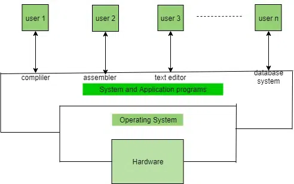

#### Functions of the OS

- Booting the Computer

  OS(kernal) is the first program run by `Boot manager`

  The process of starting or restarting the computer is known as `booting`.

  If the computer is switched off completely and if turned on then it is called `cold booting`.

  `Warm booting` is a process of using the OS to restart the computer.

- Process Management:

  In a multi-programming environment, the OS decides the order in which processes have access to the processor, and how much processing time each process has.

  This function of OS is called `Process Scheduling`. An OS performs the following activities for `Processor Management`.

  An OS manages the processor’s work by allocating various jobs to it and ensuring that each process receives enough time from the processor to function properly.

  Keeps track of the status of processes. The program which performs this task is known as a `traffic controller`. Allocates the CPU that is a processor to a process. De-allocates processor when a process is no longer required.

  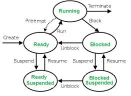

  There is various type of scheduling techniques that are used by the OS:

  - Shortest Job First(SJF): The process which needs the shortest CPU time is scheduled first.

  - Round Robin Scheduling: Each process is assigned a fixed CPU execution time in a cyclic way.

  - Priority-Based Scheduling (Non-Preemptive): In this scheduling, processes are scheduled according to their priorities, i.e., the highest priority process is scheduled first. If the priorities of the two processes match, then schedule according to arrival time.

- Memory Management:

  OS manages computer’s primary memory and provides mechanisms for optimizing memory usage.

  An OS performs the following activities for Memory Management:

  - It keeps track of primary memory, i.e., which bytes of memory are used by which user program.

    The memory addresses that have already been allocated and the memory addresses of the memory that has not yet been used.

  - In multiprogramming, the OS decides the order in which processes are granted memory access, and for how long.

  - It Allocates the memory to a process when the process requests it and deallocates the memory when the process has terminated or is performing an I/O operation.

  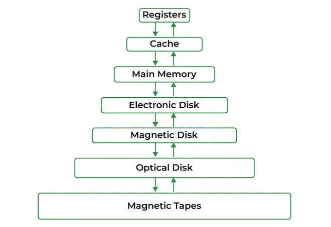

- Security:

  The OS provides various techniques which assure the integrity and confidentiality of user data.

  The following security measures are used to protect user data:

  - Protection against unauthorized access through login.

  - Protection against intrusion by keeping the firewall active.

  - Protecting the system memory against malicious access.

  - Displaying messages related to system vulnerabilities.

- Job Accounting:

  It keeps track of time and resources used by various jobs or users.

- File Management:

  A file system is organized into directories for efficient or easy navigation and usage.These directories may contain other directories and other files.

  It keeps track of where information is stored, user access settings, the status of every file, and more.

  These facilities are collectively known as the `file system`.

  An OS keeps track of information regarding the creation, deletion, transfer, copy, and storage of files in an organized way.

  It also maintains the integrity of the data stored in these files, including the file directory structure, by **protecting against unauthorized access**.

  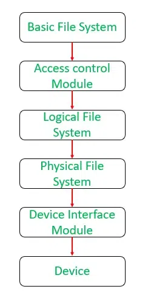

- Device Management:

  An OS manages device communication via its respective drivers. It performs the following activities for device management.

  - Keeps track of all devices connected to the system. Designates a program responsible for every device known as the `Input/Output controller`.

  - Decide which process gets access to a certain device and for how long.

  - Allocates devices effectively and efficiently. Deallocates devices when they are no longer required.

  - There are various input and output devices. An OS controls the working of these input-output devices.

  - It receives the requests from these devices, performs a specific task, and communicates back to the requesting process.

- Networking:

  - Network Communication:

    Think of them as traffic cops for your internet traffic.

    OS help computers talk to each other and the internet.

    They manage how data is packaged and sent over the network, making sure it arrives safely and in the right order.

  - Settings and Monitoring:

  Think of them as the settings and security guard for your internet connection.

  They also let you set up your network connections, like Wi-Fi or Ethernet, and keep an eye on how your network is doing.

  They make sure your computer is using the network efficiently and securely, like adjusting the speed of your internet or protecting your computer from online threats.

- User Interface:

  The user interacts with the computer system through the OS.

  Hence OS acts as an interface between the user and the computer hardware.

  This user interface is offered through a set of commands or a graphical user interface (GUI).

  Through this interface, the user makes interacts with the applications and the machine hardware.

  

- Backup and Recovery:

  OS provides mechanisms for backing up data and recovering it in case of system failures, errors, or disasters.

- Virtualization:

  OS provides virtualization capabilities that allow multiple OS or applications to run on a single physical machine.

  Work in isolation like docker container

- Performance Monitoring and Error-detecting Aids:

  OS provides tools for monitoring and optimizing system performance, including identifying bottlenecks, optimizing resource usage, and analyzing system logs and metrics.

  OS play a pivotal role in controlling and optimizing system performance.

  They act as intermediaries between hardware and software, ensuring that computing resources are efficiently utilized.

  One fundamental aspect is resource allocation, where the OS allocates CPU time, memory, and I/O devices to different processes, striving to provide fair and optimal resource utilization.

  Process scheduling, a critical function, helps decide which processes or threads should run when preventing any single task from monopolizing the CPU and enabling effective multitasking.

  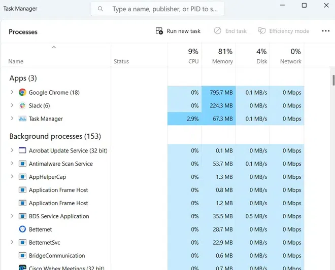

  > Error detection include the production of log file (traces, error messages) and other debugging.
  >
  > From time to time, the OS checks the system for any external threat or malicious software activity.
  >
  > It also checks the hardware for any type of damage. This process displays several alerts to the user so that the appropriate action can be taken against any damage caused to the system.

- System Calls:

  OS provides a set of system calls that enable applications to interact with the OS and access its resources.

  System calls provide a standardized interface between applications and the OS, enabling portability and compatibility across different hardware and software platforms.

#### Types of OS

1.  Batch OS

    This type of OS does not interact with the computer directly.
    There is an operator which takes similar jobs having the same requirement and groups them into batches.
    It is the responsibility of the operator to sort jobs with similar needs.

    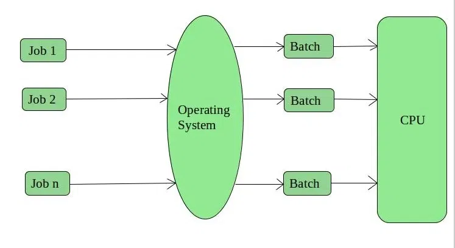

    - Advantages of Batch OS

      - Multiple users can share the batch systems.

      - The idle time for the batch system is very less.

      - It is easy to manage large work repeatedly in batch systems.

    - Disadvantages of Batch OS

      - The computer operators should be well known with batch systems.

      - Batch systems are hard to debug.

      - It is sometimes costly.

      - The other jobs will have to wait for an unknown time if any job fails.

      - In batch OS the processing time for jobs is commonly difficult to accurately predict while they are in the queue.

      - It is difficult to accurately predict the exact time required for a job to complete while it is in the queue.

    - Examples of Batch OS: Payroll Systems, Bank Statements, etc.

2.  Multi-Programming OS

    Multiprogramming OS can be simply illustrated as more than one program is present in the main memory and any one of them can be kept in execution.

    This is basically used for better execution of resources.

    

    - Advantages of Multi-Programming OS

      - Multi Programming increases the Throughput of the System.

      - It helps in reducing the response time.

    - Disadvantages of Multi-Programming OS

      - There is not any facility for user interaction of system resources with the system.

3.  Multi-Processing OS

    Multi-Processing OS is a type of OS in which more than one CPU is used for the execution of resources. It betters the throughput of the System.

    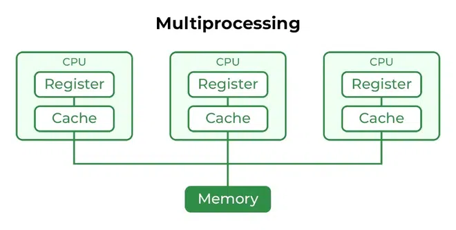

    - Advantages of Multi-Processing OS

      - It increases the throughput of the system.

      - As it has several processors, so, if one processor fails, we can proceed with another processor.

    - Disadvantages of Multi-Processing OS

      - Due to the multiple CPU, it can be more complex and somehow difficult to understand.

4.  Multi-Tasking OS

    Multitasking OS is simply a multiprogramming OS with having facility of a Round-Robin Scheduling Algorithm. It can run multiple programs simultaneously.

    There are two types of Multi-Tasking Systems which are listed below.

    - [Preemptive Multi-Tasking](https://www.geeksforgeeks.org/difference-between-preemptive-and-cooperative-multitasking/)

    - [Cooperative Multi-Tasking](https://www.geeksforgeeks.org/difference-between-preemptive-and-cooperative-multitasking/)

    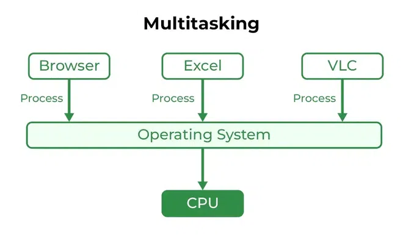

    - Advantages of Multi-Tasking OS

      - Multiple Programs can be executed simultaneously in Multi-Tasking OS.

      - It comes with proper memory management.

    - Disadvantages of Multi-Tasking OS

      - The system gets heated in case of heavy programs multiple times.

5.  Time-Sharing OS

    Each task is given some time to execute so that all the tasks work smoothly.

    Each user gets the time of the CPU as they use a single system.

    These systems are also known as `Multitasking Systems`.

    The task can be from a single user or different users also.

    The time that each task gets to execute is called `quantum`. After this time interval is over OS switches over to the next task.

    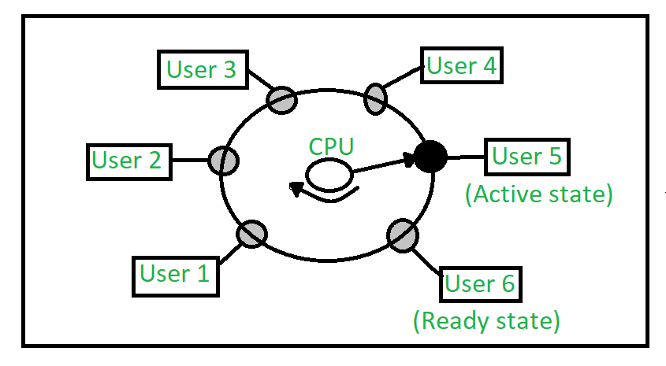

    - Advantages of Time-Sharing OS

      - Each task gets an equal opportunity.

      - Fewer chances of duplication of software.

      - CPU idle time can be reduced.

      - Resource Sharing: Time-sharing systems allow multiple users to share hardware resources such as the CPU, memory, and peripherals, reducing the cost of hardware and increasing efficiency.

      - Improved Productivity: Time-sharing allows users to work concurrently, thereby reducing the waiting time for their turn to use the computer. This increased productivity translates to more work getting done in less time.

      - Improved User Experience: Time-sharing provides an interactive environment that allows users to communicate with the computer in real time, providing a better user experience than batch processing.

    - Disadvantages of Time-Sharing OS

      - Reliability problem.

      - One must have to take care of the security and integrity of user programs and data.

      - Data communication problem.

      - High Overhead: Time-sharing systems have a higher overhead than other OS due to the need for scheduling, context switching, and other overheads that come with supporting multiple users.

      - Complexity: Time-sharing systems are complex and require advanced software to manage multiple users simultaneously. This complexity increases the chance of bugs and errors.

      - Security Risks: With multiple users sharing resources, the risk of security breaches increases. Time-sharing systems require careful management of user access, authentication, and authorization to ensure the security of data and software.

    - Examples of Time-Sharing OS with explanation

      - IBM VM/CMS: IBM VM/CMS is a time-sharing OS that was first introduced in 1972. It is still in use today, providing a virtual machine environment that allows multiple users to run their own instances of OS and applications.

      - TSO (Time Sharing Option): TSO is a time-sharing OS that was first introduced in the 1960s by IBM for the IBM System/360 mainframe computer. It allowed multiple users to access the same computer simultaneously, running their own applications.

      - Windows Terminal Services: Windows Terminal Services is a time-sharing OS that allows multiple users to access a Windows server remotely. Users can run their own applications and access shared resources, such as printers and network storage, in real-time.

6.  Distributed OS

    These types of OS is a recent advancement in the world of computer technology and are being widely accepted all over the world and, that too, at a great pace.

    Various autonomous interconnected computers communicate with each other using a shared communication network.

    Independent systems possess their own memory unit and CPU.

    These are referred to as `loosely coupled systems` or `distributed systems`.

    These systems processors differ in size and function.

    The major benefit of working with these types of the OS is that it is always possible that one user can access the files or software which are not actually present on his system but some other system connected within this network i.e., `remote access` is enabled within the devices connected in that network.

    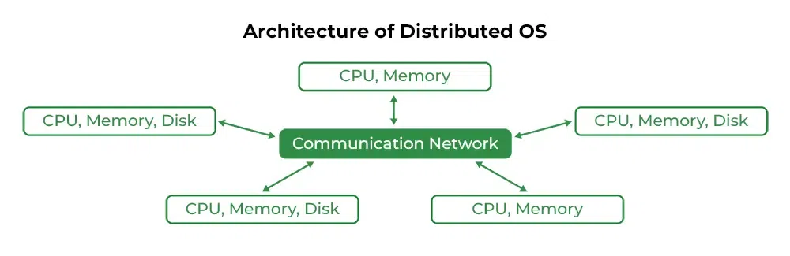

    - Advantages of Distributed OS

      - Failure of one will not affect the other network communication, as all systems are independent of each other.

      - Electronic mail increases the data exchange speed.

      - Since resources are being shared, computation is highly fast and durable.

      - Load on host computer reduces.

      - These systems are easily scalable as many systems can be easily added to the network.

      - Delay in data processing reduces.

    - Disadvantages of Distributed OS

      - Failure of the main network will stop the entire communication.

      - To establish distributed systems the language is used not well-defined yet.

      - These types of systems are not readily available as they are very expensive. Not only that the underlying software is highly complex and not understood well yet.

    - Examples of Distributed OS are LOCUS, etc.

    - The distributed os must tackle the following issues:

      - Networking causes delays in the transfer of data between nodes of a distributed system. Such delays may lead to an inconsistent view of data located in different nodes, and make it difficult to know the chronological order in which events occurred in the system.

      - Control functions like scheduling, resource allocation, and deadlock detection have to be performed in several nodes to achieve computation speedup and provide reliable operation when computers or networking components fail.

      - Messages exchanged by processes present in different nodes may travel over public networks and pass through computer systems that are not controlled by the distributed OS. An intruder may exploit this feature to tamper with messages, or create fake messages to fool the authentication procedure and masquerade as a user of the system.

7.  Network OS

    These systems run on a server and provide the capability to manage data, users, groups, security, applications, and other networking functions.

    These types of OS allow shared access to files, printers, security, applications, and other networking functions over a small private network.

    One more important aspect of Network OS is that all the users are well aware of the underlying configuration, of all other users within the network, their individual connections, etc. and that’s why these computers are popularly known as `tightly coupled systems`.

    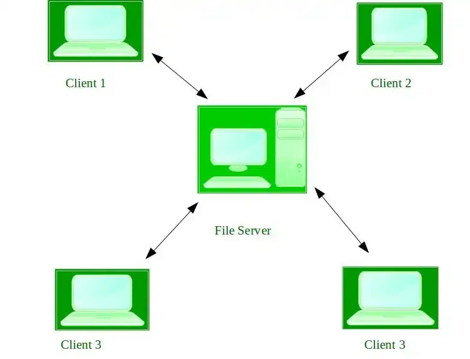

    - Advantages of Network OS

      - Highly stable centralized servers.

      - Security concerns are handled through servers.

      - New technologies and hardware up-gradation are easily integrated into the system.

      - Server access is possible remotely from different locations and types of systems.

    - Disadvantages of Network OS

      - Servers are costly.

      - User has to depend on a central location for most operations.

      - Maintenance and updates are required regularly.

    - Examples of Network OS are Microsoft Windows Server 2003, Microsoft Windows Server 2008, UNIX, Linux, Mac OS X, Novell NetWare, BSD, etc.

8.  Real-Time OS

    These types of OSs serve real-time systems. The time interval required to process and respond to inputs is very small. This time interval is called response time.

    Real-time systems are used when there are time requirements that are very strict like missile systems, air traffic control systems, robots, etc.

    - Types of Real-Time OS

      - Hard Real-Time Systems:

        Hard Real-Time OSs are meant for applications where time constraints are very strict and even the shortest possible delay is not acceptable.

        These systems are built for saving life like automatic parachutes or airbags which are required to be readily available in case of an accident. Virtual memory is rarely found in these systems.

      - Soft Real-Time Systems:

        These OSs are for applications where time-constraint is less strict.

      

    - Advantages of RTOS

      - Maximum Consumption: Maximum utilization of devices and systems, thus more output from all the resources.

      - Task Shifting: The time assigned for shifting tasks in these systems is very less. For example, in older systems, it takes about 10 microseconds in shifting from one task to another, and in the latest systems, it takes 3 microseconds.

      - Focus on Application: Focus on running applications and less importance on applications that are in the queue.

      - Real-time OS in the embedded system: Since the size of programs is small, RTOS can also be used in embedded systems like in transport and others.

      - Error Free: These types of systems are error-free.

      - Memory Allocation: Memory allocation is best managed in these types of systems.

    - Disadvantages of RTOS

      - Limited Tasks: Very few tasks run at the same time and their concentration is very less on a few applications to avoid errors.

      - Use heavy system resources: Sometimes the system resources are not so good and they are expensive as well.

      - Complex Algorithms: The algorithms are very complex and difficult for the designer to write on.

      - Device driver and interrupt signals: It needs specific device drivers and interrupts signal to respond earliest to interrupts.

      - Thread Priority: It is not good to set thread priority as these systems are very less prone to switching tasks.

    - Examples of Real-Time OS are Scientific experiments, medical imaging systems, industrial control systems, weapon systems, robots, air traffic control systems, etc.

#### Need of OS

- OS as a platform for Application programs:

  The OS provides a platform, on top of which, other programs, called `application programs` can run.

  These application programs help users to perform a specific task easily.

  It acts as an interface between the computer and the user. It is designed in such a manner that it operates, controls, and executes various applications on the computer.

- Managing Input-Output unit:

  The OS also allows the computer to manage its own resources such as memory, monitor, keyboard, printer, etc.

  The OS controls the various system input-output resources and allocates them to the users or programs as per their requirements.

- Multitasking:

  The OS manages memory and allows multiple programs to run in their own space and even communicate with each other through shared memory.

  Multitasking gives users a good experience as they can perform several tasks on a computer at a time.

- A platform for other software applications:

  Different application programs are needed by users to carry out particular system tasks.

  These applications are managed and controlled by the OS to ensure their effectiveness.

  It serves as an interface between the user and the applications, in other words.

- Controls memory:

  It helps in controlling the computer’s main memory. Additionally, it allows and deallocates memory to all tasks and applications.

- Looks after system files:

  It helps with system file management. As far as we are aware, all of the data on the system exists as files. It facilitates simple file interaction.

- Provides Security:

  It helps to maintain the system and applications safe through the authorization process. Thus, the OS provides security to the system.

#### Commonly Used OS

1. Windows

   Microsoft Windows is a collection of many graphics-oriented OS, first developed and launched in 1985 by the name Windows 1.0.

   When it started it had the aim to provide a graphical shell to the then-famous MS-DOS which had a character user interface, but it didn’t gain much popularity then.

   Slowly with the implementation of innovative features, the OS gained popularity and soon dominated the market of the Computer Industry, owing to its freedom of use and user-friendly environment.

2. UNIX

   Developed in 1970 in the Bell Lab research center UNIX became a multitasking and multiuser OS, reaching numerous platforms for use.

   It was developed by Ken Thompson, Dennis Ritchie, and a few others and later AT&T licensed UNIX to the development of many variants of Unix, serving academic and business purposes at the University of California, Berkley Software Distribution, IBM, Microsoft, and Sun Microsystem.

   The OS is totally written in C language allowing it to serve in various platforms.

   It provides a set of simple and dedicated tools to perform a well-defined task using basic functions, shell scripting, and command languages.

   As of 2014, the Unix version with the largest installed base is Apple’s macOS.

   - Advantages of UNIX

     - The OS is available on a wide variety of machines that are the most truly portable OS.

     - It has a Very efficient virtual memory system, which allows many programs to run simultaneously with a modest amount of physical memory and time.

     - The OS was primarily built to serve the complete multitasking purpose without crashing of data, and it served well along with the protected memory.

     - Has a high-level authentication system along with a fully secured environment.

   - Disadvantages of UNIX

     - This OS was primarily designed for programmers and techies and not for personal and casual use.

     - It is a command-driven OS with commands being supplied by the shell kernel and often has cryptic names which normal users find difficult to keep up with.

     - To work comfortably with the UNIX system, one needs to understand the main design features and how to command and interact with the OS.

3. LINUX

   Primarily derived from the concept of Unix, Linux became the most-prominent free and open-source OS available to everyone in the world.

   It is built around the Linux kernel and served for both desktop and server use.

   Linux was originally developed for personal computers based on the Intel x86 architecture but since then it was ported to more platforms than any other OS.

   Linux has the largest installed base of all general-purpose OS.

   It is also the leading OS on servers and other big iron systems such as mainframe computers, and the only OS used on TOP500 Supercomputers.

   The top Linux OS are Ubuntu, Fedora, OpenSUSE, RedHat, and many more.

   - Advantages of LINUX

     - The OS is open-source and available free of cost to every computer user. There are large repositories from which anyone can freely download high-quality software for almost any task.

     - Linux provides high performance for a longer time and does not require a periodic reboot to maintain the system.

     - It is one of the most secure OS and does not permit any unwanted malware and virus into the system.

     - It is designed to multitask and can perform multiple processes at the same time, without hampering the performance of the OS.

     - The OS is highly compatible and flexible to run on all modern PCs and networks.

   - Disadvantages of LINUX

     - It is not as user-friendly as Windows and users need to struggle for a few days before adapting to the behavior of OS.

     - It is not meant for gamers since it does not support any high graphics game.

     - Since there are no standard editions available for Linux, it comes with many versions, confusing the users about what to adapt and what not.

4. BOSS

   It stands for Bharat OS Solutions designed specifically by India for Indians.

   It was developed by C-DAC(Centre for Development of Advanced Computing), Chennai, to benefit the Free/Open Source Software in India.

   It has an enhanced Desktop Environment integrated with multiple Indian language support and other software.

   This project has been approved, supported, and endorsed by the Government of India.

   The OS is the product of Linux Distribution and has been derived from Debian Linux.

   BOSS Linux provides advanced features such as a web server, proxy server, database server, mail server, network server, file and print server, SMS Service, and many more.

   The latest versions are called BOSS 5.0 (ANOKHA) and BOSS 6.0 (ANOOP).

   - Advantages of BOSS

     - It is easily available and free to install and use.

     - It is a very stable OS and provides free access to many software.

     - It supports multiple Indian languages, so user-friendly at least for Indian society.

   - Disadvantages of BOSS

     - Since it is Linux OS, it does not support Windows programs and shares the same disadvantages as other Linux-based OS.

5. SOLARIS

   This OS was originally developed by Sun Microsystems and is a type of Unix OS.

   Solaris was developed as proprietary software.

   Solaris is known for its scalability, especially on SPARC systems, and for originating many innovative features such as DTrace, ZFS, and Time Slider.

   It is registered as compliant with the Single UNIX Specification.

   As of today, Solaris is supported by HP, Dell, Intel and Fujitsu Siemens architecture.

   OpenSolaris is the available open-source version of Solaris OS.

   Oracle Solaris 10 is the latest version of Solaris OS.

   - Advantages of Solaris

     - It provides good and high performance.

     - It provides complete protection against viruses and malware.

     - It is a multitasking OS and allows multiple tasks at the same time.

     - Known for its good and powerful backup tools.

   - Disadvantages of Solaris

     - Although the OS provides a graphic interface, it is not as good as other graphical user interfaces.

     - The OS is available free of cost but the updates are not available for free, so not completely open-source.

     - The OS is not user-friendly.
